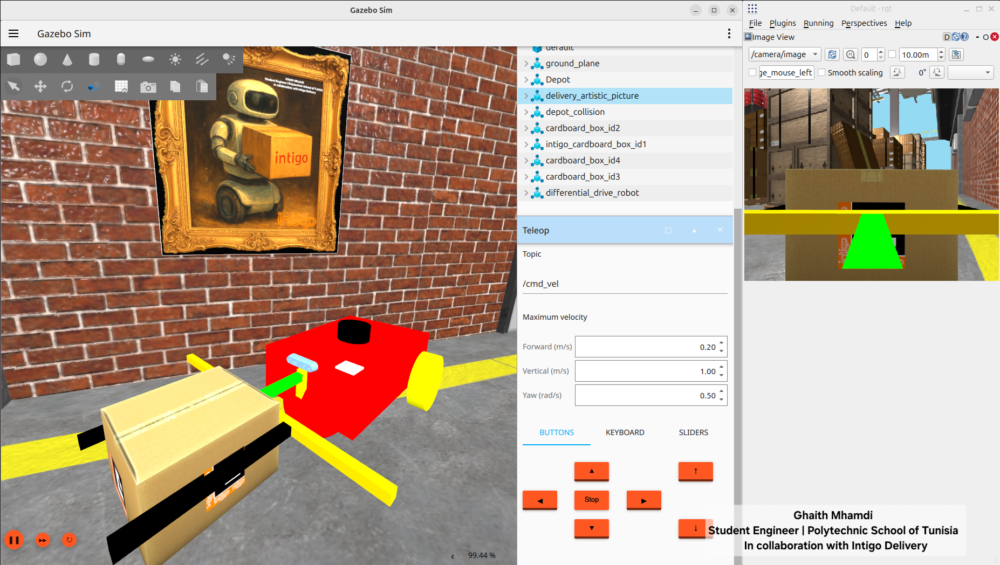
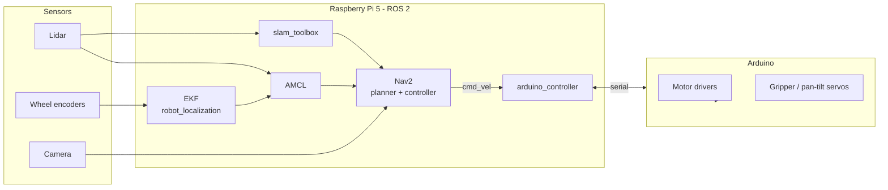
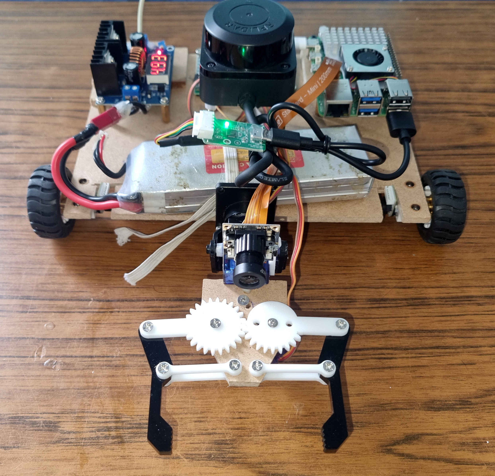
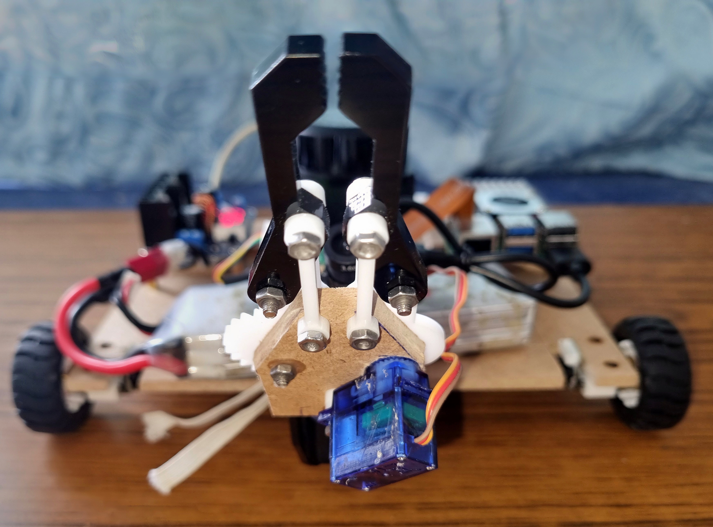
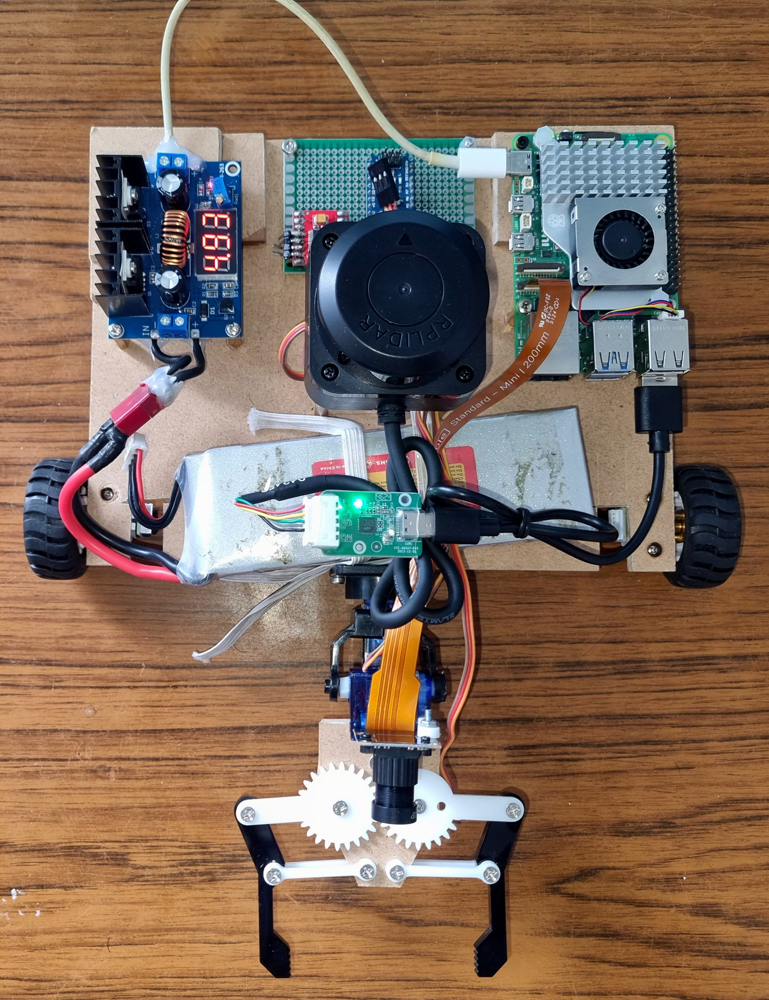
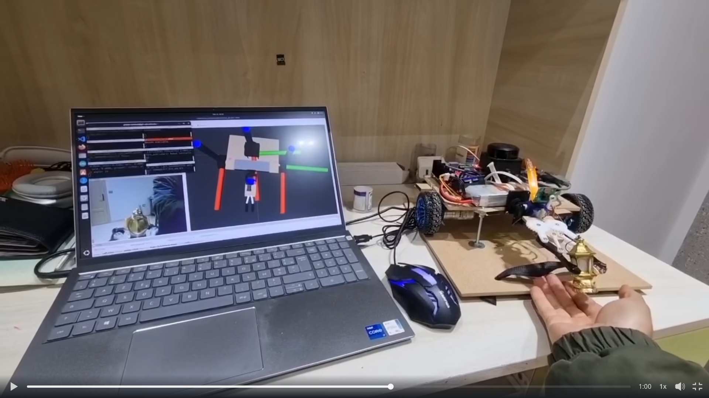
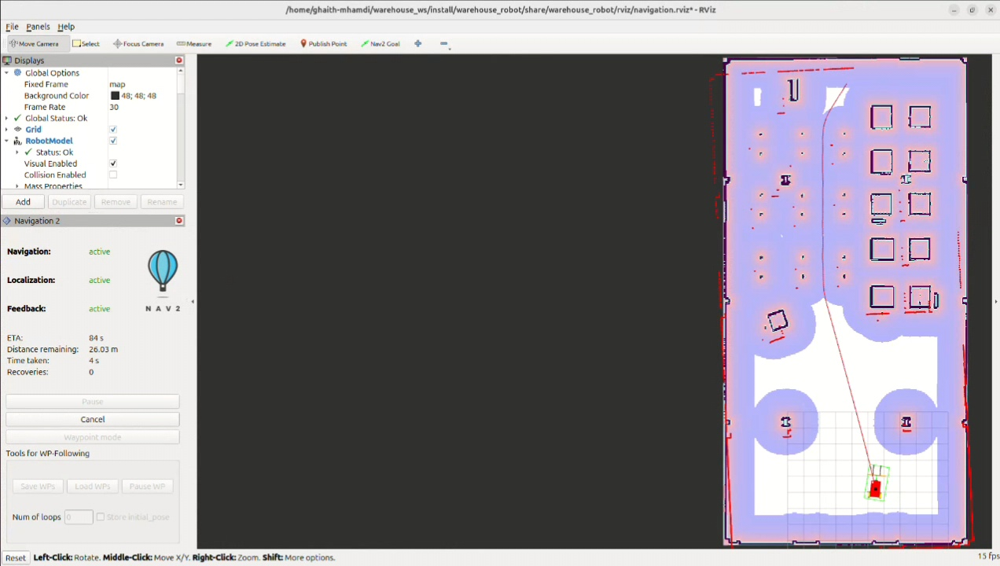
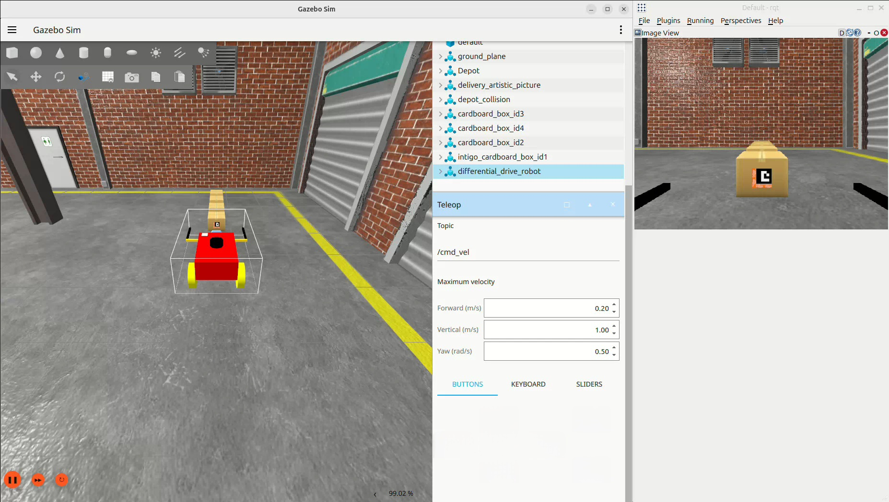

<div align="center">

<!-- TODO: media/banner.png (wide image of the robot, ~1600x500) -->


#  DOALL — Autonomous Warehouse Robot

**A mobile manipulator for warehouse logistics: SLAM, autonomous navigation, package handling, and a real-time digital twin.**
Built with ROS 2, simulated in Gazebo, deployed on a Raspberry Pi 5.


</div>

---

##  Overview

**DOALL** is a warehouse robot developed as part of the **Intigo** project. It combines a differential-drive mobile base with a gripper and a pan-tilt camera head so it can **map** an environment, **localize** itself, **navigate** autonomously, and **pick and move packages**.

The same software stack runs in two worlds:

| | Simulation | Real robot |
|---|---|---|
| Platform | Gazebo + ROS 2 on a PC | Raspberry Pi 5 + Arduino |
| Sensors | Simulated lidar, camera, IMU/odometry | Real lidar, camera, wheel encoders |
| Purpose | Development, testing, safe iteration | Deployment and validation |

A **digital twin** keeps the real robot and its simulated counterpart synchronized in real time.

---

##  Demos

> Click a preview to open the full video.

### 1. Mapping & autonomous navigation with path planning
<!-- TODO: media/mapping_navigation.gif (short preview) + media/mapping_navigation.mp4 (full) -->
[](media/mapping_navigation.mp4)

### 2. Package manipulation in the garage (Gazebo simulation)
<!-- TODO: media/manipulation_garage.gif + media/manipulation_garage.mp4 -->
[](media/manipulation_garage.mp4)

### 3. Real robot ↔ digital twin, real-time synchronization
<!-- TODO: media/digital_twin.gif + media/digital_twin.mp4 -->
[](media/digital_twin.mp4)

---

##  Features

-  **SLAM mapping** with `slam_toolbox`
-  **Localization** with AMCL on a saved map, fused with wheel odometry via an **EKF**
-  **Autonomous navigation** and path planning with **Nav2**
-  **Package manipulation** with a gripper and a pan-tilt camera head
-  **Digital twin**: real-time synchronization between the physical robot and Gazebo
-  **Arduino low-level control** (motors, joints) bridged to ROS 2
-  **Full simulation workflow**: Gazebo worlds of a warehouse and a garage
-  Modular robot description in **Xacro** (base, wheels, lidar, camera, gripper, pan-tilt)

---

##  System Architecture

<!-- TODO (optional): replace with media/architecture.png exported from draw.io -->


---

##  Hardware

<!-- TODO: media/robot_front.jpg, media/robot_side.jpg, media/robot_top.jpg -->
<p align="center">
  
  
  
</p>

| Component | Role |
|---|---|
| Raspberry Pi 5 | Main onboard computer running ROS 2 |
| Arduino | Real-time motor and servo control |
| Lidar | Mapping, localization, obstacle avoidance |
| Camera (pan-tilt) | Perception and package detection |
| Gripper | Package grasping |
| Differential-drive base | Locomotion |

<!-- TODO: fill in exact models (lidar model, motors, battery, camera) -->

---

##  Repository Structure

```
doall/
├── arduino/            # Arduino firmware + upload script
│   ├── arduino.ino
│   └── upload.sh
├── config/             # YAML configs
│   ├── slam_toolbox_mapping.yaml
│   ├── amcl_localization.yaml
│   ├── navigation.yaml
│   ├── ekf.yaml
│   └── bridge_parameters.yaml     # ROS <-> Gazebo bridge
├── doall/              # Python nodes (arduino_controller, ...)
├── launch/             # Launch files (simulation + real robot)
├── maps/               # Saved maps (.pgm + .yaml)
├── model/              # Xacro robot description
├── rviz/               # RViz configurations
├── world/              # Gazebo SDF worlds (warehouse, garage)
├── test/               # Linting tests
├── package.xml
└── setup.py
```

---

##  Getting Started

### Prerequisites

- Ubuntu 24.04 with **ROS 2 Jazzy** <!-- TODO: confirm your ROS 2 distro -->
- Gazebo (with `ros_gz` bridge)
- Nav2, `slam_toolbox`, `robot_localization`

```bash
sudo apt update
sudo apt install \
  ros-jazzy-navigation2 ros-jazzy-nav2-bringup \
  ros-jazzy-slam-toolbox ros-jazzy-robot-localization \
  ros-jazzy-ros-gz ros-jazzy-xacro \
  ros-jazzy-robot-state-publisher ros-jazzy-joint-state-publisher
```

### Build

```bash
mkdir -p ~/warehouse_ws/src && cd ~/warehouse_ws/src
git clone https://github.com/<your-username>/doall.git
cd ~/warehouse_ws
rosdep install --from-paths src --ignore-src -r -y
colcon build --symlink-install
source install/setup.bash
```

---

##  Usage

###  Simulation

```bash
# Spawn the robot in the Gazebo warehouse/garage world
ros2 launch doall sim_gazebo_model.launch.py

# Build a map with SLAM
ros2 launch doall sim_mapping.launch.py

# Localize on a saved map (AMCL)
ros2 launch doall sim_amcl_localization.launch.py

# Autonomous navigation
ros2 launch doall sim_navigation.launch.py
```

Save a map once you are happy with it:

```bash
ros2 run nav2_map_server map_saver_cli -f maps/my_room_map
```

###  Real robot (Raspberry Pi 5)

```bash
# Robot description / TF
ros2 launch doall robotdescription.launch.py

# Mapping
ros2 launch doall rob_mapping.launch.py

# Navigation on a saved map
ros2 launch doall rob_navigation.launch.py
```

###  Flash the Arduino

```bash
cd arduino
./upload.sh
```

---

##  Digital Twin

The real robot publishes its state (pose, joint positions) and the Gazebo model mirrors it in real time, allowing remote monitoring, safe testing of new behaviors, and debugging against the real robot's behavior.

<!-- TODO: media/digital_twin.png (side-by-side photo/screenshot) -->
<p align="center"></p>

---

##  Visualization

<!-- TODO: RViz / Gazebo screenshots -->
<p align="center">
  
  
</p>

---

##  Roadmap

- [x] URDF/Xacro model and Gazebo simulation
- [x] SLAM mapping and AMCL localization
- [x] Autonomous navigation with Nav2
- [x] Real robot deployment on Raspberry Pi 5
- [x] Digital twin synchronization
- [x] Package manipulation (simulation)
- [ ] Package manipulation on the real robot
- [ ] Vision-based package detection
- [ ] Multi-robot fleet coordination

<!-- TODO: adjust to your real status -->

---

##  Author

**Ghaith Mhamdi** — Engineering student, École Polytechnique de Tunisie
Robotics · Embedded Systems · FPGA · Autonomous Systems

[](https://www.linkedin.com/in/<your-handle>)
[](https://github.com/<your-username>)

---

## 📄 License

Distributed under the MIT License. See `LICENSE` for details.

<!-- TODO: add a LICENSE file, and update package.xml license field to match -->
